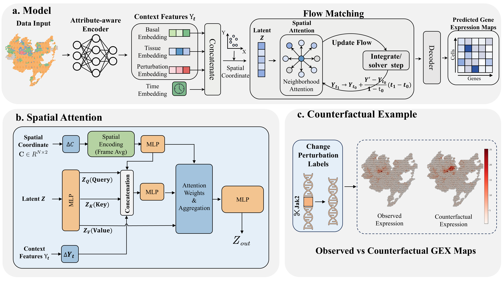

# SpaCP: Learning Spatial Counterfactual Perturbation Effects via Context-Aware Generative Modeling

This repository includes scripts and Jupyter notebooks for SpaCP, which are necessary to reproduce the benchmarking results presented in the paper. The notebook contains the corresponding experimental data, and all results can be regenerated using the provided scripts for the different methods. For more details, refer to the original repository: [SpaCP tutorial](https://github.com/Yhaokaf/SpaCP/tree/master/tutorial)



**Table of Contents**

* [Datasets](#Datasets)
* [Installation](#Installation)
* [Tutorials](#Tutorials)

## Datasets

The raw Perturb-map dataset is available via GEO under accession number GSE193460. The processed data is available via Figshare at https://figshare.com/articles/dataset/Datasets_-_Perturb-Map/29198468.


## Installation

To reproduce **SpaCP**, we suggest first creating a conda environment by:

~~~shell
conda create -n SpaCP python==3.10.12
conda activate SpaCP
~~~

Then clone the SpaCP repository:

```shell
git clone https://github.com/Yhaokaf/SpaCP.git
cd SpaCP
```

and then install the required packages below:

```shell
pip install -r requirements.txt
```


## Tutorials

We provide tutorials for SpaCP applications.

[run_SpaCP_test_perturbMap.ipynb](https://github.com/Yhaokaf/SpaCP/tree/master/tutorial)

